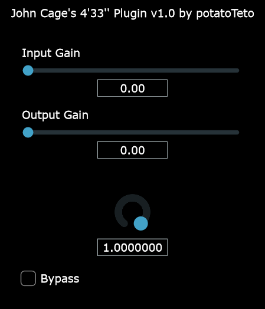

# John Cage's 4'33'' Plugin

[](https://github.com/potatoTeto/john-cage-4-33-plugin/releases)

## Download Link
https://github.com/potatoTeto/john-cage-4-33-plugin/releases

## Overview

**John Cage's 4'33'' Plugin** is a JUCE-based **VST3 / Standalone plugin** that does absolutely nothing to the input signal — it just sits there. But hey, it comes with some cool sliders anyway!

If you want to direct any hate, please send it to: hello@google.com

---

## Building from Source

### Dependencies

- [JUCE](https://juce.com/) — Required to compile the project.

### Instructions

1. Clone the repository:
    ```sh
    git clone https://github.com/potatoTeto/john-cage-4-33-plugin.git
    cd 433
    ```

2. Ensure **Visual Studio 2022** (or compatible version) is installed and added to your system PATH.

3. Open ``433.jucer`` in ``JUCE/Projucer.exe`` and then hit ``File -> Save``. This should generate an entire ``/Build/`` directory from within this project's root directory. You might need to re-map the Module directories: By default, they should all be located at ``C:\JUCE\modules\``.

4. Run the ``build-and-package.ps1`` Powershell script, passing the version tag as an argument:
    ```powershell
    ./build-and-package.ps1 v1.0.0
    ```
    Replace `v1.0.0` with your desired version string.

5. The compiled binaries will end up in packaged ``.7z`` archives from within the `publish` folder.

---

## License

This project is licensed under the MIT License. See the [LICENSE](LICENSE) file for details.

---

## Contact & Maintenance

I currently have no plans to actively maintain this repository, but **Pull Requests are always welcome**! For questions or issues, please open an issue on the GitHub repository.
